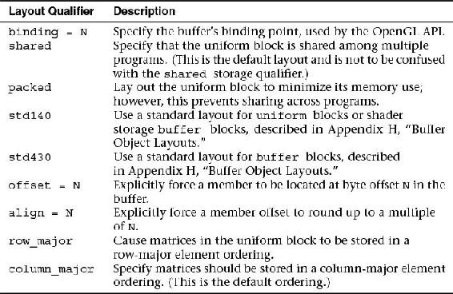

# Description
	- Le qualificateur **uniform** indique qu'une variable est accessible depuis l'application *(côté CPU)*.
	- La valeur d'une variable **uniform** est assignée avant l'exécution du shader.
	- Une variable **uniform** peut être de n'importe quel type *(primitive, struct, tableau...)*.
- # Accéder à une variable uniform
	- Pour accéder depuis l'application *(côté CPU)* à une variable qualifié **uniform** dans un shader, la fonction ((6576119e-c48e-40fe-b8d7-d362c1221cc2)) doit être appelé au moins une fois pour récupérer la localisation dans le shader de la variable.
- # Modifier la valeur d'une variable uniform
	- Après avoir récupérer la localisation d'une variable **uniform**, il est possible de modifier son contenu.
	- Ces jeux de fonctions sont disponibles :
		- ```c
		  void glUniform{1234}{fdi ui}(GLint location,
		                               TYPE value);
		  
		  void glUniform{1234}{fdi ui}v(GLint location,
		                                GLsizei count,
		                                const TYPE *values);
		  
		  void glUniformMatrix{234}{fd}v(GLint location,
		                                 GLsizei count,
		                                 GLboolean transpose,
		                                 const GLfloat *values);
		  
		  void glUniformMatrix{2x3,2x4,3x2,3x4,4x2,4x3}{fd}v(GLint location,
		                                                     GLsizei count,
		                                                     GLboolean transpose,
		                                                     const GLfloat *values);
		  ```
	- TODO Savoir si les tableaux d'uniforms prennent plusieurs localisations.
- # Bloc d'uniformes
	- Plusieurs données d'uniformes peuvent être regroupées dans un même bloc.
	- Voici la syntax pour déclarer un tel bloc :
		- ```c
		  uniform bloc
		  {
		  	vec4 v1;
		      bool v2;
		  };
		  ```
			- Le bloc n'a pas de nom, ainsi pour accéder aux variables, il faut directement mettre leur nom : *v1* et *v2*.
		- ```c
		  uniform bloc
		  {
		  	vec4 v1;
		      bool v2;
		  } nom;
		  ```
			- Cette fois-ci le bloc a un nom donc les variables sont accessibles en mettant le nom du bloc : *nom.v1* et *nom.v2*.
		- Seuls les ((65745df6-6ec3-4539-9483-c36ebb531655)) sont permis dans les blocs d'uniformes.
	- ## Qualificateurs pour les blocs d'uniformes
		- 
	- ## Récupérer la localisation d'un bloc d'uniformes
		- La fonction ((6575f42d-565a-46b7-bd81-49222c7004e4)) peut être utilisé.
	- ## Créer un buffer pour stocker les données
	- ## Layout std140
		- L'alignement commence toujours à `0`.
		- Chaque *offset* doit être un multiple de `16`.
			- | **Calcule de multiples** | **16** |
			  | **0** | 0 |
			  | **1** | 16 |
			  | **2** | 32 |
			  | **3** | 48 |
			  | **4** | 64 |
			  | **5** | 80 |
			  | ... | ... |
		- | **Type de variable** | **Taille et alignement** |
		  | `bool`, `int`, `uint`, `float`, `double` | La taille et l'alignement sont égaux à la taille machine *sizeof(type)*. |
		  | Vecteurs à 2 composants | La taille et l'alignement sont égaux à 2 fois la taille machine d'un composant. |
		  | Vecteurs à 2 et 3 composants | La taille et l'alignement sont égaux à 4 fois la taille machine d'un composant. |
		  | Tableau de primitifs ou de vecteurs | La taille de chaque élément sera la taille machine d'un élément arrondie au supérieur pour atteindre la taille d'un `vec4`. Qui est aussi la valeur de l'alignement. |
		  | ... | ... |
		- **Exemple :**
			- ```c
			  layout (std140) uniform ExampleBlock
			  {
			                       // base alignment  // aligned offset
			      float value;     // 4               // 0 
			      vec3 vector;     // 16              // 16  (offset must be multiple of 16 so 4->16)
			      mat4 matrix;     // 16              // 32  (column 0)
			                       // 16              // 48  (column 1)
			                       // 16              // 64  (column 2)
			                       // 16              // 80  (column 3)
			      float values[3]; // 16              // 96  (values[0])
			                       // 16              // 112 (values[1])
			                       // 16              // 128 (values[2])
			      bool boolean;    // 4               // 144
			      int integer;     // 4               // 148
			  }; 
			  ```
			-