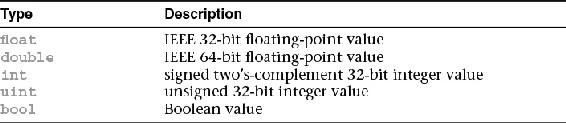
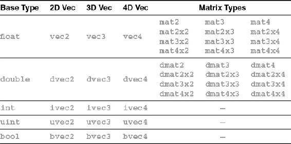
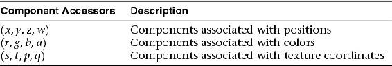
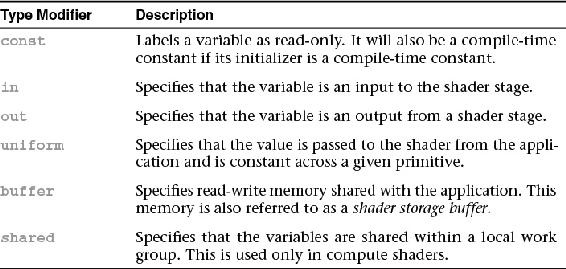
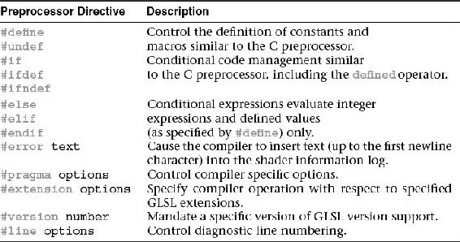

# Chapitres
	- ## [[OpenGL Fonctions]]
	- ## [[OpenGL Dessiner]]
	- ## [[OpenGL Uniformes]]
	- ## [[OpenGL Texture]]
	- ## [[OpenGL Buffers]]
- # GLSL
	- ## Types de données
		- ### Types transparents
		  id:: 65745df6-6ec3-4539-9483-c36ebb531655
			- {:height 140, :width 601}
			- Un type transparent expose la forme interne de la donnée au shader, ce qui veut dire que de part le nom du type de donnée, nous savons comment se constitue la donnée.
		- ### Types opaques
			- A l'inverse, un type opaque n'indique pas clairement la forme de la donnée.
			- C'est un *handler* qui permet d'accéder à une donnée stockée en interne dans **OpenGL**.
			- Par exemple, les `samplers` sont des types opaques.
		- ### Vecteurs et matrices
			- 
			- Les matrices ne peuvent contenir que des **float** ou des **double**.
			- Le 1er numéro d'une matrice indique le nombre de colonnes, ainsi le 2ème numéro indique le nombre de lignes.
				- Par exemple, `mat4x2` possède 4 colonnes et 2 lignes.
			- Pour accéder à une valeur de vecteur, plusieurs façons existent :
				- 
				- Ou de façon plus traditionnelle avec les crochets : `vec[0]`.
		- ### Qualificateurs de stockage
			- 
			- Comme en langage C, le qualificateur `const` indique que la variable est en lecture seule, donc il est nécessaire de lui assigner une valeur et la modifier génère une erreur.
			- `in` indique que la variable entre dans le shader depuis le shader précédent.
			- `out` indique que la variable sort du shader pour devenir une entrée du prochain shader.
			- `uniform` indique que la valeur de la variable sera assignée par l'application avant l'exécution du shader et ne change pas durant l'exécution de plusieurs shaders. Plus de détails sont disponibles sur la page [[OpenGL Uniformes]].
			- `buffer` indique que la variable est un large buffer de données. Plus de détails sur la page [[OpenGL Buffers]].
			- `shared` est utilisé uniquement par les `compute shaders`.
	- ## Préprocesseur
		- 
		- ### Options
			- Grâce à la directive `#pragma` il est possible de changer les options de compilation du shader.
			- Voici la liste des options :
				- `optimize` : *on* ou *off*
					- Permet d'activer ou de désactiver l'optimisation du shader lors de sa compilation.
					- Par défaut l'optimisation est activée pour tous les shaders.
				- `debug` : *on* ou *off*
					- Permet d'activer ou de désactiver un diagnostic supplémentaire lors de la gestion d'erreurs du shader.
					- Per défaut le debug est désactivé pour tous les shaders.
				-